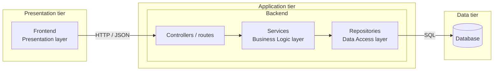

# Computer Management Web Application

> This project was made to satisfy the final term of Software Engineering.

## Table Of Contents

- [Overview](#overview)
- [Quick Start](#quick-start)

## Overview

This repository is dedicated towards using Open Source Softwares to create the program,as well as document any hurdles along the way.

**Key Features**
- Can be self-hosted by the user
- Open Source
- Frontend/Backend is containerized for ease of deployment

## Architecture

The system has three **tiers**(what runs where, each has its own container). The backend is further organized into **layers**



## Quick Start
```bash
git clone https://github.com/Narwhal1412/Software-Engineering-Finale.git
cd Software-Engineering-Finale
cp .env.example .env # then edit with your own values
docker compose up --build
```
