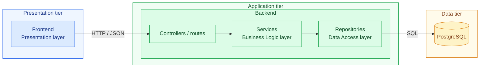

# Computer Management Web Application

> This project was made to satisfy the final term of Software Engineering.

## Table Of Contents

- [Overview](#overview)
- [Architecture](#architecture)
- [Repository Structure](#repository-structure)
- [Prerequisites](#Prerequisites)
- [Quick Start](#quick-start)
- [Environment Variable](#environment-variables)
- [Documentation](#documentation)

## Overview

This repository is dedicated towards using Open Source Softwares to create the program,as well as document any hurdles along the way.

**Key Features**
- Can be self-hosted by the user
- Open Source
- Frontend/Backend is containerized for ease of deployment

## Architecture

The system has three **tiers**(what runs where, each has its own container). The backend is further organized into **layers**.



| Tier | Layer(s) | Technology | Details |
|------|----------|------------|---------|
| Presentation | Presentation | ... | [Frontend/README.md](Frontend/README.md) |
| Application | Business Logic, Data Access | ... | [Backend/README.md](Backend/README.md) |
| Data | none (data store) | PostgreSQL | defined in `compose.yaml` |

## Repository Structure

```
.
├── Backend/          	  # API service
├── Frontend/         	  # Web UI
├── .woodpecker 	  # CI/CD Pipeline instructions yaml files
├── docs/             	  # Plans, notes, design decisions
├── .env.example      	  # Template for required environment variables
├── compose.yaml      	  # Defines how the services run together
├── compose.override.yaml # Override ports mapping for local deployment
├── compose.prod.yaml 	  # Override for adding labels for CI/CD
├── .gitignore 		  # Files ignored(.env) when pushed to git 
└── README.md
```

## Prerequisites

- [Git](https://git-scm.com)
- [Docker](https://docs.docker.com/get-started/get-docker/)

## Quick Start
```bash
git clone https://github.com/Narwhal1412/Software-Engineering-Finale.git
cd Software-Engineering-Finale
cp .env.example .env # then edit with your own values
docker compose up --build
```
| Service | URL |
|---------|-----|
| Frontend | http://localhost:<port> |
| Backend API | http://localhost:<port> |

Stop everything with `docker compose down`.

## Environment Variables

Copy `.env.example` to `.env` and fill in the values.

```
cp .env.example .env
```
| Variable | Description | Example |
|----------|-------------|---------|
| `DB_USER` | Database username | `app` |
| `DB_PASSWORD` | Database password | `change-me` |
| `DB_NAME` | Database name | `appdb` |
| `APP_PORT` | Port the backend listens on | `8080` |
 
## Documentation

